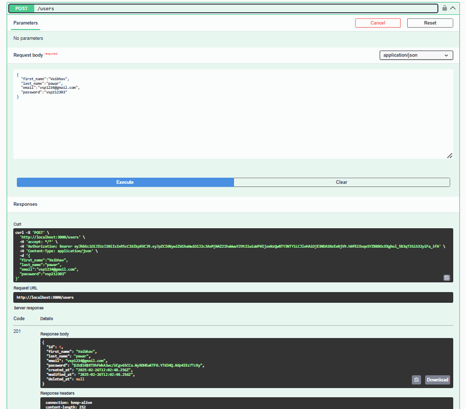
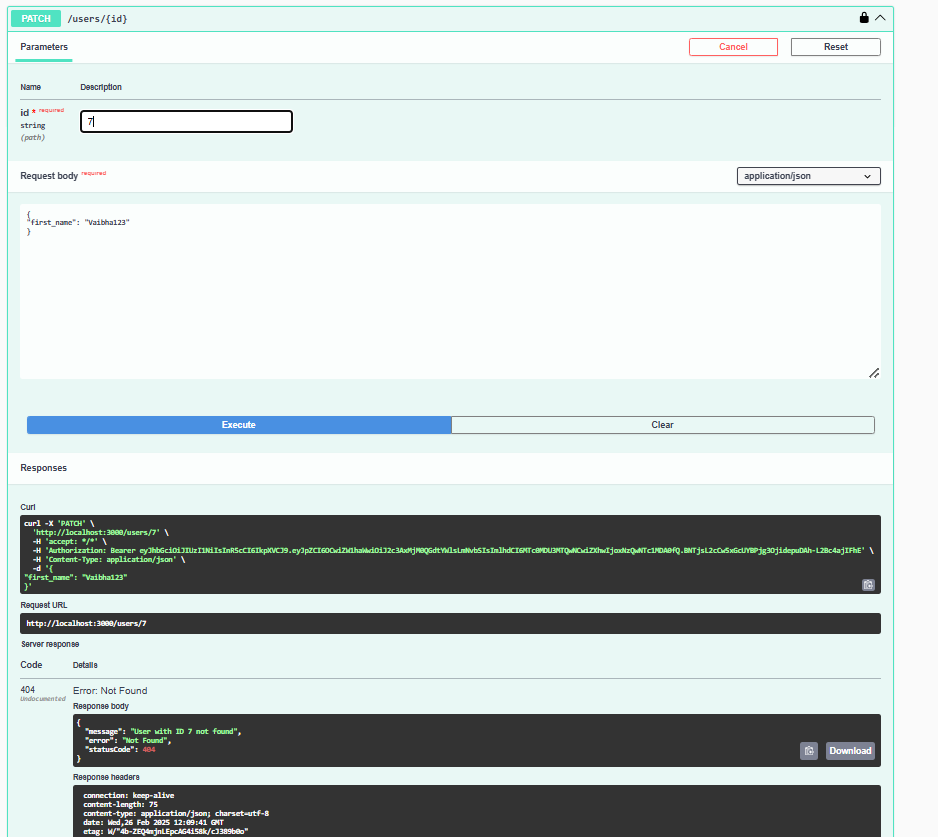

<p align="center">
  <a href="http://nestjs.com/" target="_blank">
    
  </a>
</p>

<h1 align="center">NestJS Application</h1>

<p align="center">
  A progressive <a href="http://nodejs.org" target="_blank">Node.js</a> framework for building efficient and scalable server-side applications.
</p>

<p align="center">
  <a href="https://circleci.com/gh/nestjs/nest">
    
  </a>
</p>

---

## 📂 Project Structure

```
nestjs_extracted/
│── .env
│── .gitignore
│── .prettierrc
│── eslint.config.mjs
│── nest-cli.json
│── package.json
│── package-lock.json
│── README.md
│── tsconfig.build.json
│── tsconfig.json
│── src/
│   │── app.module.ts
│   │── main.ts
│   │── auth/
│   │   │── auth.controller.ts
│   │   │── auth.module.ts
│   │   │── auth.service.ts
│   │   │── jwt-auth.guard.ts
│   │   │── dto/
│   │   │   │── login.dto.ts
│   │── config/
│   │   │── database.config.ts
│   │── users/
│   │   │── user.entity.ts
│   │   │── users.controller.ts
│   │   │── users.module.ts
│   │   │── users.service.ts
│   │   │── dto/
│   │   │   │── user.dto.ts
│── test/
│   │── app.e2e-spec.ts
│   │── jest-e2e.json
```

---

## ⚡ Installation

Ensure you have [Node.js](https://nodejs.org/) installed before proceeding.

```bash
$ npm install
```

---

## 🚀 Running the Application

### Development Mode
```bash
$ npm run start
```

### Watch Mode
```bash
$ npm run start:dev
```

### Production Mode
```bash
$ npm run start:prod
```

---

## 🧪 Running Tests

### Unit Tests
```bash
$ npm run test
```

### End-to-End Tests
```bash
$ npm run test:e2e
```

### Test Coverage
```bash
$ npm run test:cov
```

### End-to-End Test Details
The E2E test covers the following:
1. **User Creation**: Generates a unique email for each test run and creates a user.
2. **User Login**: Logs in the created user and retrieves a JWT token.
3. **Access Control**: Verifies that protected routes require authentication.
4. **Fetch Users**: Retrieves a list of users when authenticated.
5. **Update User**: Updates user details using JWT authentication.
6. **Soft Delete User**: Soft deletes a user with authentication.
6. **hard Delete User**: hard deletes a user with authentication (currently not in test but included in api).

---

## 🔑 Authentication & User Management

### Auth Controller (`src/auth/auth.controller.ts`)

- **POST** `/auth/login`  
  - Accepts `LoginDto` payload.
  - Calls `authService.login(loginDto)`.
  - **Authentication:** No guard applied.


### User Controller (`src/users/users.controller.ts`)

- **GET** `/users`  
  - Returns a list of users.
  - **Authentication:** Requires JWT (`@UseGuards(JwtAuthGuard)`).
  
  
  

- **POST** `/users`  
  - Accepts `CreateUserDto` payload.
  - Calls `userService.create(createUserDto)`.
  - **Authentication:** No guard applied.



**Payload:**
```json
{
  "first_name": "Vaibhav",
  "last_name": "Pawar",
  "email": "vsp123@gmail.com",
  "password": "vsp212303"
}
```

- **PATCH** `/users/:id`  
  - Accepts `UpdateUserDto` payload.
  - Calls `userService.update(id, updateUserDto)`.
  - **Authentication:** Requires JWT (`@UseGuards(JwtAuthGuard)`).




**Payload:**
```json
{
  "first_name": "Vaibha123"
}
```

- **DELETE** `/users/:id/soft`  
  - Soft deletes a user.
  - Calls `userService.softDelete(id)`.
  - **Authentication:** Requires JWT (`@UseGuards(JwtAuthGuard)`).


- **DELETE** `/users/:id/hard`  
  - Permanently deletes a user.
  - Calls `userService.hardDelete(id)`.
  - **Authentication:** Requires JWT (`@UseGuards(JwtAuthGuard)`).


